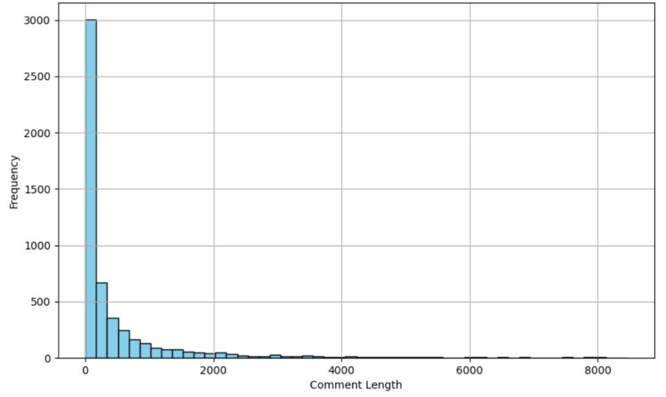
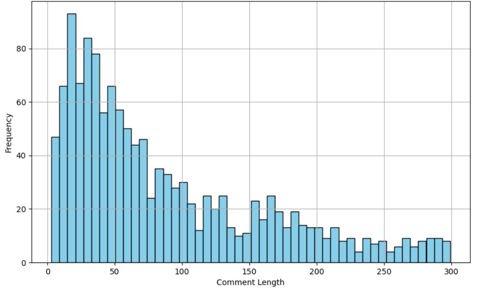
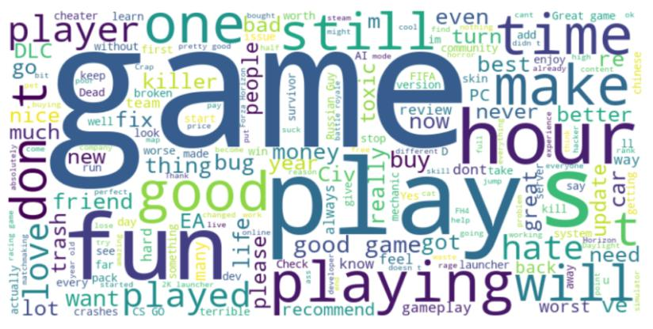
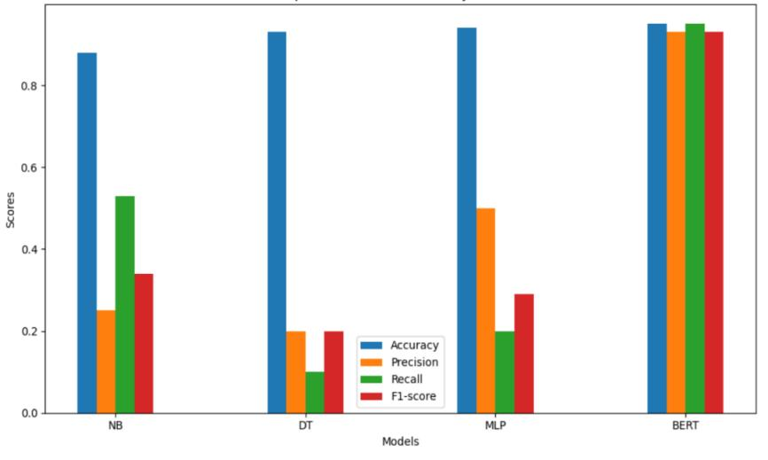
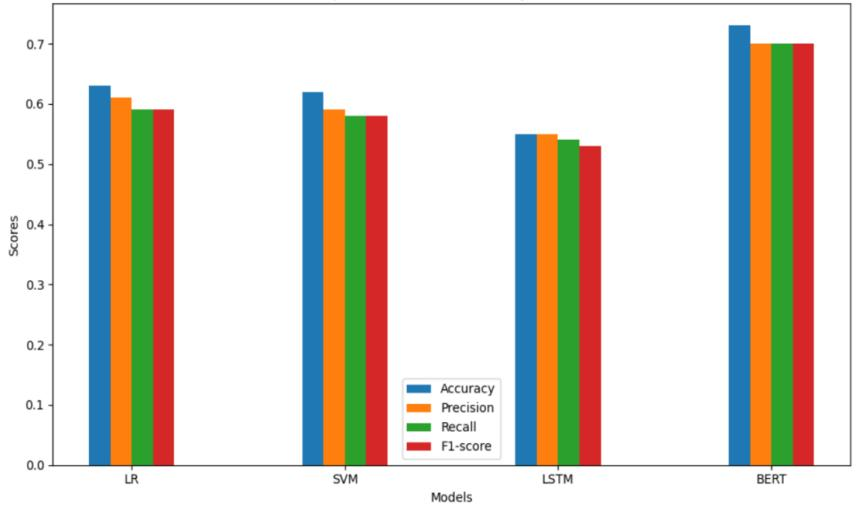

# 🎮 Steam Game Reviews Sarcasm & Sentiment Analysis using BERT

## 📌 Business Context
As a Marketing & Strategy major, I recognize that traditional sentiment analysis often fails to detect **sarcasm** in gaming communities (e.g., leaving a "positive" review with heavily sarcastic negative text). This project leverages deep learning to help game developers and marketers uncover the *true* voice of the customers.

## ⚙️ Tech Stack & Methodology
* **Language/Frameworks:** Python, PyTorch, HuggingFace Transformers, Scikit-learn
* **Model:** Fine-tuned `bert-base-uncased` for a multi-task classification (Sentiment + Sarcasm).
* **Data Processing:** Web scraping via Selenium (Original raw data is redacted due to privacy/TOS, dummy data is provided for testing).

---

## 🗂️ Data Engineering Pipeline

To prove the end-to-end capability of this project, here is a glimpse of the data transformation process, from web scraping to deep learning tensor generation.

**Step 1: Raw Scraped Data**
Data collected via Selenium, capturing user IDs, raw review texts, playtime, and recommendations.

**Step 2: Processed Data for BERT (Tokenization & Masking)**
Text cleaning and transformation using HuggingFace Tokenizer, converting raw text into `input_ids` and `attention_mask` tensors required for PyTorch model training.

---

## 📊 Project Visualizations & Model Performance

Hiring Managers can find the core proof of this project's success through the following data stories. 

### 1. What Are Gamers Really Saying?
Here is the word cloud of the scraped reviews. It visually demonstrates the highly emotional language used in Steam reviews, mixing high-frequency praise with negative complaints.

### 2. Solving the Sarcasm Detection Problem (The Killer Application)
This is the most critical chart of the project. We compared Logistic Regression (LR), Long Short-Term Memory (LSTM), and BERT.
Traditional models completely failed to capture sarcastic comments, barely reaching 40% Accuracy. My fine-tuned **BERT model achieved a breakthrough of ~95% accuracy** in detecting complex sarcastic sentiment. 

### 3. Baseline Sentiment Classification (Positive, Neutral, Negative)
Here are the results for the basic 3-way sentiment classification (without isolating sarcasm). BERT still provided the best stable performance, achieving an overall accuracy of 73%.

---

## 💡 Business Implication
This pipeline can be directly integrated into a company's CRM or social listening tools to flag high-priority sarcastic complaints that would otherwise be missed. It prevents false-positive sentiment reporting and helps product teams pinpoint critical user frustrations.

---

## 📁 Repository Structure
* `1_web_scraper.py` : Scrapes game reviews from Steam using Selenium.
* `2_data_preprocessing.py` : Text cleaning and tokenization for BERT.
* `3_sentiment_model.py` : PyTorch training script for 3-way sentiment classification.
* `4_sarcasm_model.py` : PyTorch training script specifically for sarcasm detection.
* `sample_data.csv` : Dummy dataset provided for code execution and testing.
* `Project_Executive_Summary_EN.pdf` : A 2-page English presentation of the business value and model architecture.
* `Thesis_Original_Chinese.pdf` : The original academic thesis (in Chinese) for academic proof.
